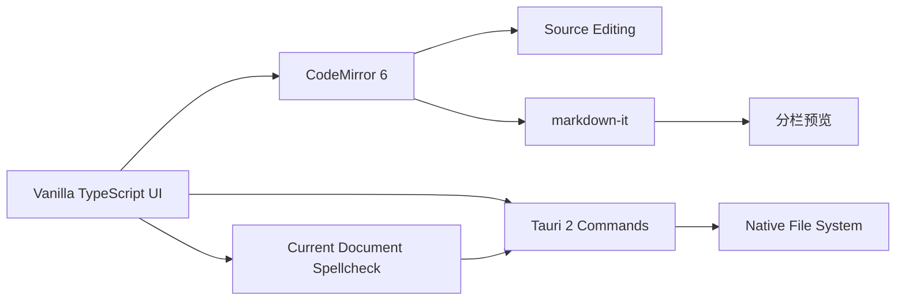

# LightNote

**LightNote（轻笺）** 是一个轻量、离线优先的桌面 Markdown 编辑器。它使用 Tauri 2 构建，单栏模式专注于源码编辑，分栏模式提供右侧实时渲染预览。

## 功能

- 单栏源码编辑：稳定显示完整 Markdown 源码，避免编辑态样式干扰。
- 左右分栏：左侧完整 Markdown 源码，右侧实时预览；桌面端可拖拽分隔条调整宽度。
- 焦点跟随预览：分栏时预览按编辑器光标和滚动位置定位到对应 Markdown 块。
- KaTeX：支持行内数学和块级数学预览。
- GFM 表格和代码块：单栏直接编辑源码，分栏预览完整渲染。
- Mermaid：在分栏预览中异步渲染流程图。
- 原生菜单与快捷键：通过 Tauri 原生“文件、编辑、视图”菜单操作当前文档，支持常用编辑与视图快捷键。
- 视图设置：在“视图 -> 显示模式”中选择编辑器、预览或分栏；在“视图 -> 主题”中选择跟随系统、浅色或深色主题。
- 界面语言：在“视图 -> 语言”中选择跟随系统、中文简体或 English；选择后关闭并重新打开应用生效，并会记住选择。
- 自动保存：已打开的可写文件停止编辑 1 秒后自动保存；新文档首次仍需手动选择保存位置。
- 当前文档搜索：使用 CodeMirror 查找/替换，支持 `Ctrl+F`、`Ctrl+H`、`F3` 和 `Shift+F3`。
- 英文拼写检查：Rust 侧使用 Hunspell 兼容词典检查当前文档，并在编辑器中标记可能的拼写错误。
- 文件操作：打开和保存 `.md`、`.markdown` 和 `.txt` 文件，支持 `Ctrl+S`。
- 离线优先：编辑与本地保存不依赖远程服务。
- Windows 集成：安装时可选择添加右键菜单；支持文件关联后双击或右键直接用 LightNote 打开。

## 架构



| 层 | 主要技术 | 职责 |
| --- | --- | --- |
| 桌面容器 | Tauri 2、Rust | 启动应用、原生菜单、全局聚焦快捷键和原子文件写入。 |
| 编辑器 | CodeMirror 6 | Markdown 源码编辑、当前文档查找替换和拼写标记。 |
| 拼写检查 | spellbook、dictionary-en | 使用嵌入式英语 Hunspell 兼容词典检查当前文档。 |
| 渲染 | markdown-it、KaTeX、Mermaid、DOMPurify | 预览和内容清理。 |
| 前端 | Vite、Vanilla TypeScript | 视图切换、文件导入保存和菜单交互。 |

## 使用方法

### 单栏模式

通过“显示模式 -> 单栏编辑”进入。左侧为纯源码编辑区，始终显示完整 Markdown 文本，不进行编辑态渲染。

常用输入规则：

- 输入 `# ` 或 `## ` 后继续输入，创建标题。
- 输入 `- `、`* ` 或 `1. ` 后继续输入，创建列表。
- 输入 `> ` 后继续输入，创建引用。
- 输入 `**文字**`、`*文字*`、`` `代码` `` 创建行内格式。
- 输入 `$E = mc^2$` 创建行内公式；使用 ```math 围栏创建块级公式。

### 分栏模式

通过“显示模式 -> 分栏”进入。左侧继续显示 Markdown 源码，右侧实时渲染预览。桌面端拖拽两栏之间的分隔条即可调整宽度，比例会自动记住；编辑器光标移动或滚动时，预览会即时定位到对应内容。

### 单栏预览模式

通过“显示模式 -> 单栏预览”进入，仅显示右侧预览面板，便于专注阅读。

### 文件操作

- “打开文件”：导入 `.md`、`.markdown` 或 `.txt`。
- “保存文件”：将当前内容写回已打开的可写文件；只读文件或新文档会弹出保存位置。也可以使用 `Ctrl+S`。
- “视图 -> 主题”：可选择跟随系统、浅色或深色主题，页面、编辑器、预览、代码块和 Mermaid 图表会同步更新。
- “视图 -> 语言”：可选择跟随系统、中文简体或 English。默认跟随操作系统语言；手动选择后需要重启应用，菜单、窗口标题和应用文案会统一切换。Windows 原生打开/保存对话框继续跟随 Windows 系统语言。
- 自动保存：已打开的可写文件在停止编辑 1 秒后自动写回。若磁盘文件已被其他程序修改，自动保存会暂停，手动保存时可选择是否覆盖。
- 当前文档查找：`Ctrl+F` 查找，`Ctrl+H` 查找和替换，`F3`/`Shift+F3` 跳转到下一个/上一个匹配。
- 全局聚焦：`Ctrl+Shift+Space` 可在应用失焦或最小化时唤起 LightNote；若快捷键已被其他应用占用，LightNote 仍会正常启动。
- 资源管理器右键：安装后可在 `.md`、`.markdown`、`.txt` 文件上直接选择 “Open with LightNote”。

### 快捷键

| 快捷键 | 操作范围 | 功能 |
| --- | --- | --- |
| `Ctrl+O` | 当前窗口 | 打开文件 |
| `Ctrl+S` | 当前文件 | 手动保存 |
| `Ctrl+F` | 当前文档 | 查找 |
| `Ctrl+H` | 当前文档 | 查找和替换 |
| `F3` / `Shift+F3` | 当前文档 | 下一个/上一个匹配 |
| `Ctrl+Z` / `Ctrl+Y` | 当前文档 | 撤销/重做 |
| `Ctrl+1` / `Ctrl+2` / `Ctrl+3` | 当前窗口 | 单栏编辑/单栏预览/分栏 |
| `Ctrl+Shift+Space` | 系统全局 | 唤起并聚焦 LightNote |

## 开发

### 环境要求

- Node.js 20 或更高版本。
- Rust stable 工具链。
- Windows 上需要 Visual Studio C++ Build Tools，包含 MSVC 和 Windows SDK。

### 安装与运行

```bash
npm install
npm run tauri dev
```

仅运行前端开发服务器：

```bash
npm run dev
```

## 打包发布

Tauri 应在**目标操作系统**上构建：请在 Windows 上生成 Windows 安装包，在 macOS 上生成 macOS 安装包。不要将未验证的跨平台产物用于发布。

打包前先安装依赖，并确认前端构建可通过：

```bash
npm install
npm run build
```

### Windows

前置条件：Node.js 20+、Rust stable、Visual Studio C++ Build Tools（勾选 MSVC 与 Windows SDK）。

执行：

```powershell
npm run tauri build
```

该命令会通过仓库内的 Tauri 包装脚本调用 CLI；在 Windows 上打包前会先清理旧安装包，并将 `src-tauri/target/` 及其 bundle 目录标记为“无内容索引”，以降低资源管理器或 Windows Search 对新产物的瞬时占用概率。

当前仓库默认会在 `src-tauri/target/release/bundle/` 下生成 Windows 安装包，通常包括：

- `msi/`：MSI 安装包，适合企业部署和静默安装。
- `nsis/`：NSIS 安装程序，适合普通用户分发。

安装体验说明：

- NSIS 安装器支持 English 和简体中文语言选择，默认使用 Windows 系统语言；MSI 分别提供英文和简体中文安装包。
- NSIS 安装器会在安装流程里询问是否添加 `.md`、`.markdown`、`.txt` 的右键菜单（默认“是”）。
- MSI/NSIS 都会包含文件关联声明，安装后可通过系统“打开方式/默认应用”将这些扩展名关联到 LightNote。
- 卸载时会自动清理 LightNote 写入的右键菜单注册表项。

当前版本的具体产物路径为：

- `src-tauri/target/release/bundle/msi/LightNote_0.1.0_x64_en-US.msi`
- `src-tauri/target/release/bundle/msi/LightNote_0.1.0_x64_zh-CN.msi`
- `src-tauri/target/release/bundle/nsis/LightNote_0.1.0_x64-setup.exe`
- `src-tauri/target/release/lightnote.exe`：未打包的 Windows 可执行文件。

发布前建议使用代码签名证书签名 `.msi` 或安装程序，以减少 Windows SmartScreen 警告。可使用 Windows SDK 自带的 `signtool`，或在 CI 中配置签名步骤。

如果确实需要 MSI，可单独尝试：

```powershell
npx tauri build --bundles msi
```

当前仓库会在打包前清理旧的 MSI/NSIS 安装包，并将 `src-tauri/target/` 及其 bundle 目录标记为“无内容索引”，以降低 Windows Search 或资源管理器对新产物的瞬时占用概率。即使在安装包已经生成后出现短暂文件锁，包装脚本也只会在确认本次请求的安装包都已生成且可访问后返回成功。

### macOS

前置条件：macOS 主机、Xcode Command Line Tools、Node.js 20+ 和 Rust stable。

```bash
xcode-select --install
npm run tauri build
```

默认产物位于 `src-tauri/target/release/bundle/`：

- `macos/`：应用包 `.app`。
- `dmg/`：可分发的磁盘映像 `.dmg`。

面向其他 macOS 用户发布时，建议使用 Apple Developer ID 对应用签名并完成公证；未签名或未公证的应用会被 Gatekeeper 拦截。Tauri 支持通过环境变量提供证书、签名身份、Apple ID、应用专用密码和 Team ID，建议在 CI 的受保护密钥中配置，避免将证书或密码提交到仓库。

### 常用检查

```bash
# 前端类型检查与生产打包
npm run build

# 检查 Rust 后端
cargo check --manifest-path src-tauri/Cargo.toml

# 构建桌面安装包
npm run tauri build
```

如果只想得到未打包的可执行文件，可在目标平台运行：

```bash
cargo build --manifest-path src-tauri/Cargo.toml --release
```

其路径通常是 `src-tauri/target/release/`。正式分发仍建议使用上面的安装包。

## 项目结构

```text
.
├── src/
│   ├── main.ts          # 编辑器、预览和文件操作
│   └── styles.css       # 应用与编辑器样式
├── src-tauri/
│   ├── src/lib.rs       # Tauri 命令与文件操作
│   ├── capabilities/    # 对话框权限
│   └── tauri.conf.json  # 桌面应用配置
├── scripts/
│   ├── tauri-wrapper.mjs         # Windows 下包装 tauri build，处理安装包瞬时文件锁
│   └── prepare-windows-bundle.mjs # 打包前清理旧产物并降低索引占用概率
├── index.html           # 页面壳
└── package.json         # 前端脚本与依赖
```

## 数据与隐私

LightNote 只处理当前打开的单个文件，不扫描目录，不维护文档库或全文索引，也不会在应用数据目录保存文档副本。已打开的可写文件会自动写回；未指定保存位置的新文档在应用关闭后不会保留。

## 已知限制

- 当前只编辑一个活动文档，不提供多文档列表或历史版本。
- 搜索和拼写检查仅针对当前文档，不提供目录搜索或应用级索引。
- 拼写检查首版使用英语词典，只标记可能的错误，不提供替换建议或用户词典。
- Mermaid 仅在分栏预览中渲染；单栏保持 Mermaid 围栏源码，便于编辑。
