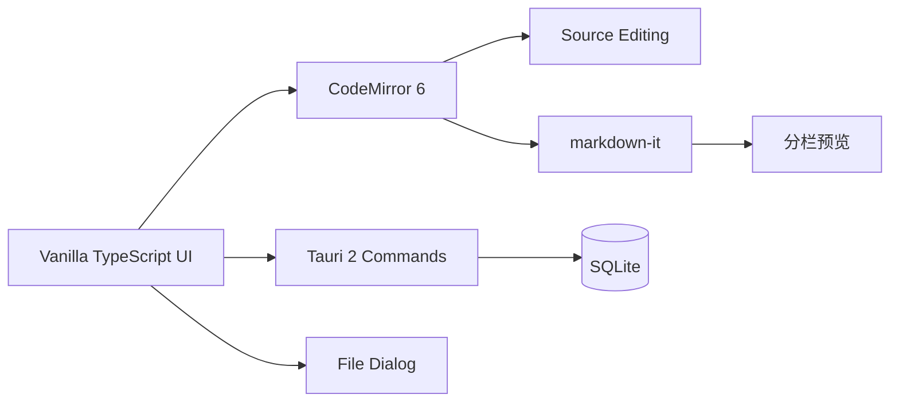

# LightNote

**LightNote（轻笺）** 是一个轻量、离线优先的桌面 Markdown 编辑器。它使用 Tauri 2 构建，单栏模式专注于源码编辑，分栏模式提供右侧实时渲染预览。

## 功能

- 单栏源码编辑：稳定显示完整 Markdown 源码，避免编辑态样式干扰。
- 左右分栏：左侧完整 Markdown 源码，右侧实时预览。
- KaTeX：支持行内数学和块级数学预览。
- GFM 表格和代码块：单栏直接编辑源码，分栏预览完整渲染。
- Mermaid：在分栏预览中异步渲染流程图。
- 自动保存：内容保存至本地 SQLite 数据库，应用重启后恢复。
- 文件操作：打开 `.md`、`.markdown` 和 `.txt` 文件。
- 离线优先：编辑与本地保存不依赖远程服务。
- Windows 集成：安装时可选择添加右键菜单；支持文件关联后双击或右键直接用 LightNote 打开。

## 架构



| 层 | 主要技术 | 职责 |
| --- | --- | --- |
| 桌面容器 | Tauri 2、Rust | 启动应用、SQLite 持久化、原生能力权限。 |
| 编辑器 | CodeMirror 6 | Markdown 源码编辑。 |
| 渲染 | markdown-it、KaTeX、Mermaid、DOMPurify | 预览和内容清理。 |
| 前端 | Vite、Vanilla TypeScript | 视图切换、自动保存、文件导入和菜单交互。 |

## 使用方法

### 单栏模式

通过“显示模式 -> 单栏编辑”进入。左侧为纯源码编辑区，始终显示完整 Markdown 文本，不进行编辑态渲染。

常用输入规则：

- 输入 `# ` 或 `## ` 后继续输入，创建标题。
- 输入 `- `、`* ` 或 `1. ` 后继续输入，创建列表。
- 输入 `> ` 后继续输入，创建引用。
- 输入 `**文字**`、`*文字*`、`` `代码` `` 创建行内格式。
- 输入 `$E = mc^2$` 创建行内公式；使用 ```math 围栏创建块级公式。

### 分栏模式

通过“显示模式 -> 分栏”进入。左侧继续显示 Markdown 源码，右侧实时渲染预览。

### 单栏预览模式

通过“显示模式 -> 单栏预览”进入，仅显示右侧预览面板，便于专注阅读。

### 文件操作

- “打开文件”：导入 `.md`、`.markdown` 或 `.txt`。
- 资源管理器右键：安装后可在 `.md`、`.markdown`、`.txt` 文件上直接选择 “Open with LightNote”。

## 开发

### 环境要求

- Node.js 20 或更高版本。
- Rust stable 工具链。
- Windows 上需要 Visual Studio C++ Build Tools，包含 MSVC 和 Windows SDK。

### 安装与运行

```bash
npm install
npm run tauri dev
```

仅运行前端开发服务器：

```bash
npm run dev
```

## 打包发布

Tauri 应在**目标操作系统**上构建：请在 Windows 上生成 Windows 安装包，在 macOS 上生成 macOS 安装包。不要将未验证的跨平台产物用于发布。

打包前先安装依赖，并确认前端构建可通过：

```bash
npm install
npm run build
```

### Windows

前置条件：Node.js 20+、Rust stable、Visual Studio C++ Build Tools（勾选 MSVC 与 Windows SDK）。

执行：

```powershell
npm run tauri build
```

默认会在 `src-tauri/target/release/bundle/` 下生成 Windows 安装包，通常包括：

- `msi/`：MSI 安装包，适合企业部署和静默安装。
- `nsis/`：NSIS 安装程序，适合普通用户分发。

安装体验说明：

- NSIS 安装器会在安装流程里询问是否添加 `.md`、`.markdown`、`.txt` 的右键菜单（默认“是”）。
- MSI/NSIS 都会包含文件关联声明，安装后可通过系统“打开方式/默认应用”将这些扩展名关联到 LightNote。
- 卸载时会自动清理 LightNote 写入的右键菜单注册表项。

当前版本的具体产物路径为：

- `src-tauri/target/release/bundle/msi/LightNote_0.1.0_x64_en-US.msi`
- `src-tauri/target/release/bundle/nsis/LightNote_0.1.0_x64-setup.exe`
- `src-tauri/target/release/lightnote.exe`：未打包的 Windows 可执行文件。

发布前建议使用代码签名证书签名 `.msi` 或安装程序，以减少 Windows SmartScreen 警告。可使用 Windows SDK 自带的 `signtool`，或在 CI 中配置签名步骤。

### macOS

前置条件：macOS 主机、Xcode Command Line Tools、Node.js 20+ 和 Rust stable。

```bash
xcode-select --install
npm run tauri build
```

默认产物位于 `src-tauri/target/release/bundle/`：

- `macos/`：应用包 `.app`。
- `dmg/`：可分发的磁盘映像 `.dmg`。

面向其他 macOS 用户发布时，建议使用 Apple Developer ID 对应用签名并完成公证；未签名或未公证的应用会被 Gatekeeper 拦截。Tauri 支持通过环境变量提供证书、签名身份、Apple ID、应用专用密码和 Team ID，建议在 CI 的受保护密钥中配置，避免将证书或密码提交到仓库。

### 常用检查

```bash
# 前端类型检查与生产打包
npm run build

# 检查 Rust 后端
cargo check --manifest-path src-tauri/Cargo.toml

# 构建桌面安装包
npm run tauri build
```

如果只想得到未打包的可执行文件，可在目标平台运行：

```bash
cargo build --manifest-path src-tauri/Cargo.toml --release
```

其路径通常是 `src-tauri/target/release/`。正式分发仍建议使用上面的安装包。

## 项目结构

```text
.
├── src/
│   ├── main.ts          # 编辑器、预览、文件操作和自动保存
│   └── styles.css       # 应用与编辑器样式
├── src-tauri/
│   ├── src/lib.rs       # Tauri 命令与 SQLite 初始化
│   ├── capabilities/    # 对话框权限
│   └── tauri.conf.json  # 桌面应用配置
├── index.html           # 页面壳与操作按钮
└── package.json         # 前端脚本与依赖
```

## 数据与隐私

LightNote 将当前文档保存到应用数据目录下的 SQLite 数据库中。打开外部文件不会自动覆盖源文件。请自行备份重要文档。

## 已知限制

- 当前 SQLite 模型只保存一个活动文档，不提供多文档列表或历史版本。
- Mermaid 在分栏预览中渲染；单栏保持 Mermaid 围栏源码，便于编辑。
